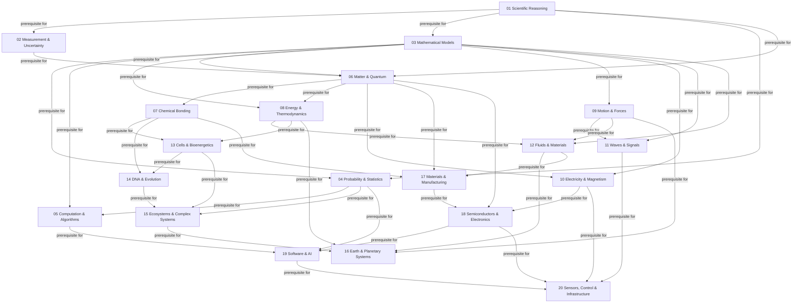

# Complete Dependency Map

This map is generated from the Phase 10 canonical graph. Every arrow points from a direct prerequisite to the dependent module.

## Canonical direct prerequisites

| Module | Direct prerequisites |
| --- | --- |
| 01 Scientific Reasoning | None |
| 02 Measurement & Uncertainty | 01 |
| 03 Mathematical Models | 01 |
| 04 Probability & Statistics | 01, 03 |
| 05 Computation & Algorithms | 03, 04 |
| 06 Matter & Quantum | 01, 02, 03 |
| 07 Chemical Bonding | 06 |
| 08 Energy & Thermodynamics | 03, 06 |
| 09 Motion & Forces | 03 |
| 10 Electricity & Magnetism | 03, 06 |
| 11 Waves & Signals | 03, 09 |
| 12 Fluids & Materials | 03, 08, 09 |
| 13 Cells & Bioenergetics | 07, 08 |
| 14 DNA & Evolution | 07, 13 |
| 15 Ecosystems & Complex Systems | 04, 13, 14 |
| 16 Earth & Planetary Systems | 08, 09, 12, 15 |
| 17 Materials & Manufacturing | 06, 07, 12 |
| 18 Semiconductors & Electronics | 06, 10, 17 |
| 19 Software & AI | 04, 05, 18 |
| 20 Sensors, Control & Infrastructure | 10, 11, 18, 19 |

## Reading rule

`A -->|prerequisite for| B` means A is assumed before B. Enabling, constraining, measuring, modelling, and controlling relations belong in the science-to-technology map and must not be confused with prerequisites.

## Phase 10 synthesis boundaries

- This document is a reviewed route or crosscutting synthesis, not proof that one mechanism, architecture, or historical sequence is inevitable.
- Every equation, quantity, and causal claim inherits the assumptions and validity limits stated in the linked reviewed modules.
- Technology performance depends on architecture, implementation, operating conditions, measurement boundary, lifecycle, safety, security, and human organisation.
- `Reviewed` records focused reconciliation; it does not mean independently certified or release-ready.
