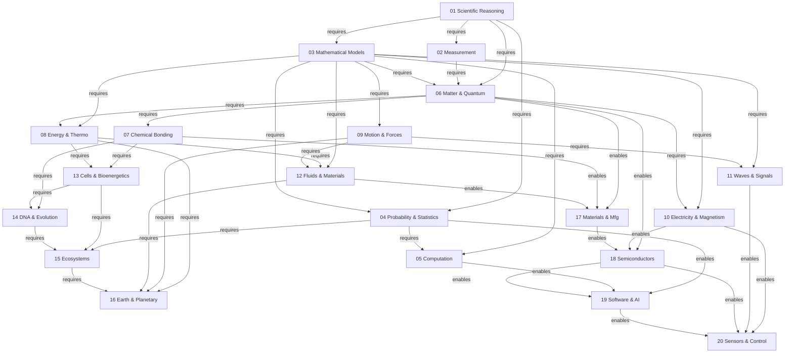

# Complete Dependency Map

This map shows all prerequisite and enabling relationships among the 20 modules. Arrows point from prerequisite to dependent module, with labelled relationship types.

## Dependency summary table

| Module | Direct prerequisites |
| --- | --- |
| 01 Scientific Reasoning | None |
| 02 Measurement | 01 |
| 03 Mathematical Models | 01 |
| 04 Probability & Statistics | 01, 03 |
| 05 Computation | 03, 04 |
| 06 Matter & Quantum | 01, 02, 03 |
| 07 Chemical Bonding | 06 |
| 08 Energy & Thermo | 03, 06 |
| 09 Motion & Forces | 03 |
| 10 Electricity & Magnetism | 03, 06 |
| 11 Waves & Signals | 03, 09 |
| 12 Fluids & Materials | 03, 08, 09 |
| 13 Cells & Bioenergetics | 07, 08 |
| 14 DNA & Evolution | 07, 13 |
| 15 Ecosystems | 04, 13, 14 |
| 16 Earth & Planetary | 08, 09, 12, 15 |
| 17 Materials & Manufacturing | 06, 07, 12 |
| 18 Semiconductors & Electronics | 06, 10, 17 |
| 19 Software & AI | 04, 05, 18 |
| 20 Sensors, Control & Infrastructure | 10, 11, 18, 19 |

## Allowed relationship labels used

| Label | Meaning |
| --- | --- |
| requires | The target module assumes knowledge from the source |
| enables | The source module's science makes the target technology possible |
| constrains | The source module's laws set limits on the target |
| controls | The source module provides the control logic for the target |
| measures | The source module provides measurement methods for the target |
| transforms | The source module's mechanisms transform inputs in the target |
| is modelled by | The source phenomenon is represented by models in the target |

## Reading this map

Start at Module 01 (the only module with no prerequisites). Follow arrows downward and rightward to trace learning paths. Any path from 01 to 20 passes through a valid sequence of prerequisite knowledge. The six pathways in [`pathways/`](../pathways/) each trace one such route in detail.
