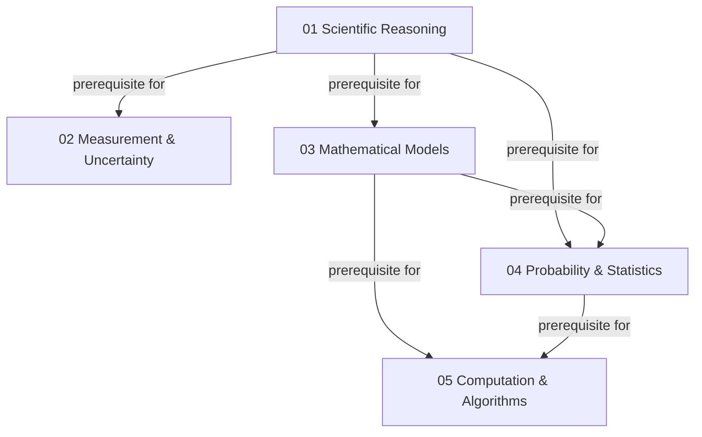

# Foundations Map

This map shows the canonical prerequisite direction among Modules 01–05. Every prerequisite arrow points from the knowledge assumed first to the module that depends on it.

## Canonical direct prerequisites

| Module | Direct prerequisites |
| --- | --- |
| 01 Scientific Reasoning | None |
| 02 Measurement & Uncertainty | 01 |
| 03 Mathematical Models | 01 |
| 04 Probability & Statistics | 01, 03 |
| 05 Computation & Algorithms | 03, 04 |

## Reading rule

`A -->|prerequisite for| B` means learners should normally understand A before B. Measurement data can inform models and algorithms can implement models, but those are non-prerequisite relations and are intentionally omitted from this prerequisite-only map.

## Phase 10 synthesis boundaries

- This document is a reviewed route or crosscutting synthesis, not proof that one mechanism, architecture, or historical sequence is inevitable.
- Every equation, quantity, and causal claim inherits the assumptions and validity limits stated in the linked reviewed modules.
- Technology performance depends on architecture, implementation, operating conditions, measurement boundary, lifecycle, safety, security, and human organisation.
- `Reviewed` records focused reconciliation; it does not mean independently certified or release-ready.
