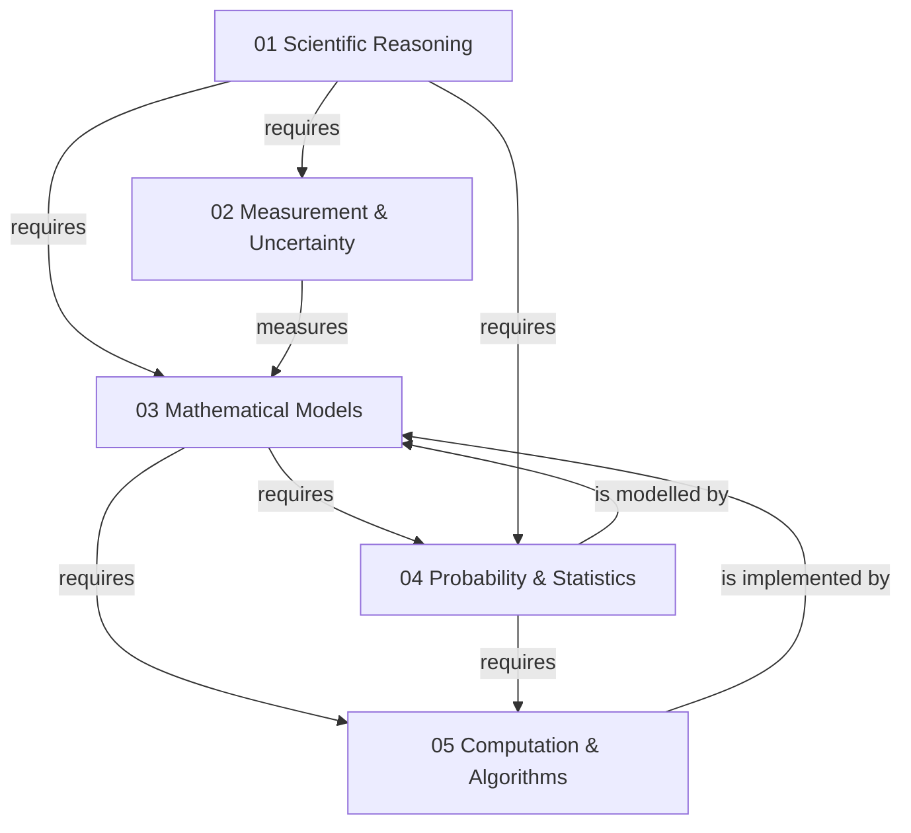

# Foundations Map

This map shows the dependency relationships among the five foundational modules — the intellectual tools that all science and technology modules require.

## Relationship key

| From | To | Label | Meaning |
| --- | --- | --- | --- |
| 01 | 02 | requires | Measurement depends on reasoning about evidence and error |
| 01 | 03 | requires | Mathematical modelling depends on understanding what models explain |
| 01 | 04 | requires | Statistical inference depends on reasoning about hypotheses |
| 03 | 04 | requires | Probability theory uses mathematical formalism |
| 03 | 05 | requires | Numerical methods implement mathematical models |
| 04 | 05 | requires | Simulation uses statistical sampling (Monte Carlo) |
| 02 | 03 | measures | Measurement provides the data that models describe |
| 04 | 03 | is modelled by | Statistical distributions are mathematical objects |
| 05 | 03 | is implemented by | Algorithms execute mathematical procedures |

## Reading this map

Arrows point from prerequisite to dependent module. A learner entering the repository should begin at Module 01 (no incoming arrows) and follow the arrows outward. Modules 04 and 05 have the most prerequisites and are best approached after the others.
