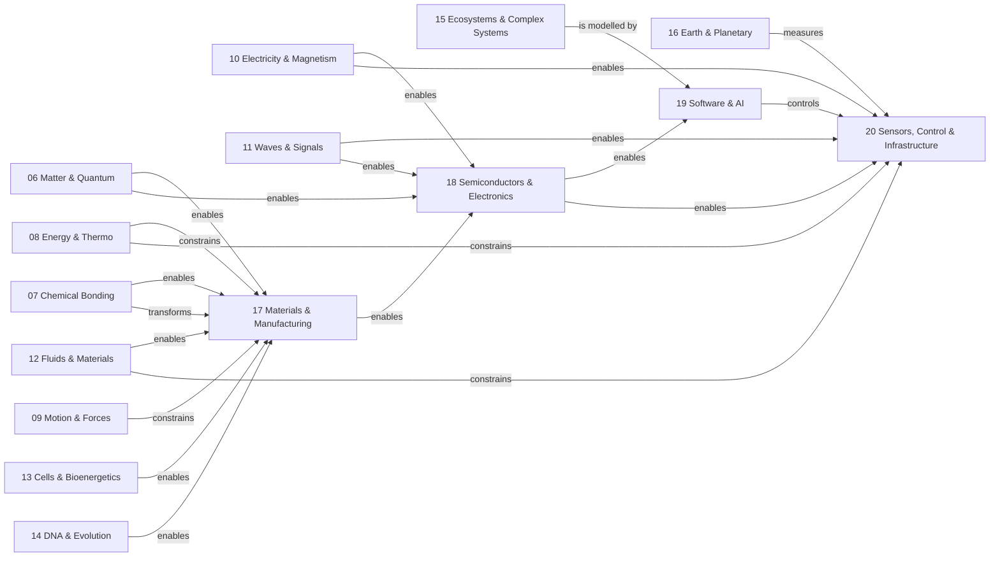

# Science to Technology Map

This map shows how the science modules (06–16) enable the technology modules (17–20) through specific mechanisms.

## Relationship key

| From | To | Label | Meaning |
| --- | --- | --- | --- |
| 06 Matter & Quantum | 17 Materials | enables | Atomic theory explains material properties |
| 06 Matter & Quantum | 18 Semiconductors | enables | Band theory from quantum mechanics |
| 07 Chemical Bonding | 17 Materials | enables, transforms | Bond chemistry determines material synthesis |
| 08 Energy & Thermo | 17 Materials | constrains | Thermodynamic limits on processing |
| 08 Energy & Thermo | 20 Infrastructure | constrains | Carnot efficiency limits power generation |
| 09 Motion & Forces | 17 Materials | constrains | Mechanical loads constrain material choice |
| 10 Electricity & Magnetism | 18 Semiconductors | enables | Electromagnetic theory underlies circuits |
| 10 Electricity & Magnetism | 20 Infrastructure | enables | Induction enables power generation |
| 11 Waves & Signals | 18 Semiconductors | enables | Signal processing in electronic systems |
| 11 Waves & Signals | 20 Infrastructure | enables | Sensing and communication |
| 12 Fluids & Materials | 17 Materials | enables | Mechanical properties and processing |
| 12 Fluids & Materials | 20 Infrastructure | constrains | Fluid dynamics constrains cooling and hydraulics |
| 15 Complex Systems | 19 Software & AI | is modelled by | Network and learning theory |
| 16 Earth & Planetary | 20 Infrastructure | measures | Environmental monitoring drives infrastructure |
| 17 Materials | 18 Semiconductors | enables | Fabrication enables chip manufacturing |
| 18 Semiconductors | 19 Software & AI | enables | Hardware runs software |
| 18 Semiconductors | 20 Infrastructure | enables | Electronics in sensors and controllers |
| 19 Software & AI | 20 Infrastructure | controls | Software controls automated systems |

## Reading this map

Science modules appear on the left; technology modules on the right. The flow is generally left-to-right (science enables technology), with inter-technology dependencies flowing top-to-bottom (materials → electronics → software → control).
