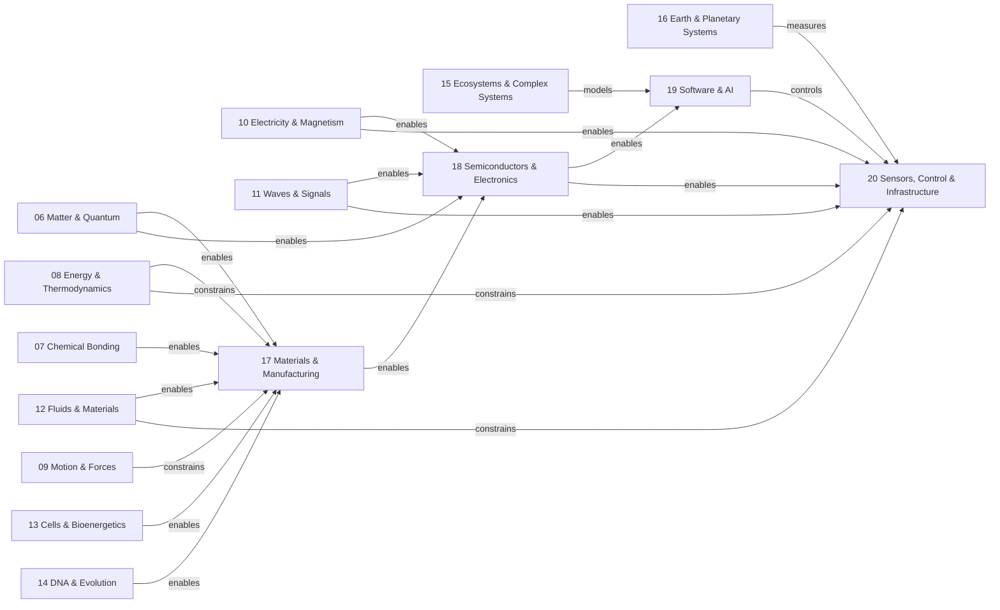

# Science to Technology Map

This map shows selected enabling and constraining relationships between reviewed science and technology modules. These are not a substitute for the canonical prerequisite graph.

## Relationship vocabulary

| Label | Meaning |
| --- | --- |
| enables | Supplies a mechanism, material, or capability used by the target. |
| constrains | Supplies limits, conservation laws, or operating boundaries. |
| measures | Supplies measurement or inference methods. |
| models | Supplies representations or computational methods. |
| controls | Supplies decision, feedback, or coordination logic. |

A relation is selective rather than exhaustive. Technology also depends on manufacturing, institutions, standards, maintenance, operators, safety, security, economics, and lifecycle governance.

## Phase 10 synthesis boundaries

- This document is a reviewed route or crosscutting synthesis, not proof that one mechanism, architecture, or historical sequence is inevitable.
- Every equation, quantity, and causal claim inherits the assumptions and validity limits stated in the linked reviewed modules.
- Technology performance depends on architecture, implementation, operating conditions, measurement boundary, lifecycle, safety, security, and human organisation.
- `Reviewed` records focused reconciliation; it does not mean independently certified or release-ready.
